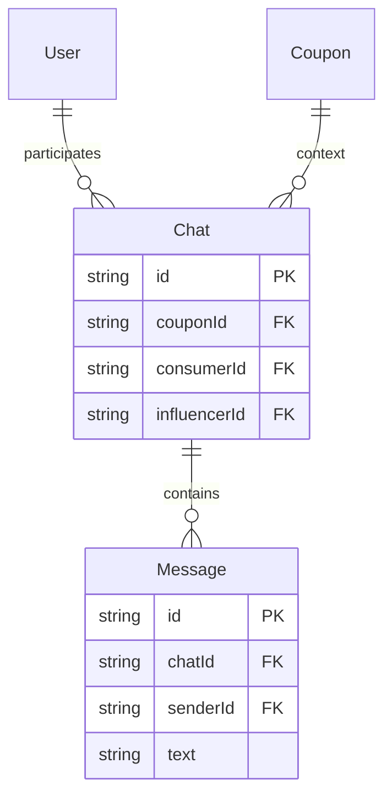

# Chat Architecture Design

## Overview
The chat system is designed to be **context-aware** and **coupon-centric**. This means every conversation is inextricably linked to a specific coupon offer. This prevents context switching confusion and allows influencers to know exactly which promotion the consumer is asking about.

## Database Schema

### 1. Chats Table
Represents a conversation thread.

| Field | Type | Description |
|-------|------|-------------|
| `id` | string (PK) | Unique identifier |
| `couponId` | string (FK) | The coupon this chat is about |
| `consumerId` | string (FK) | The consumer initiating the chat |
| `influencerId` | string (FK) | The influencer who owns the coupon |
| `createdAt` | datetime | Creation timestamp |
| `updatedAt` | datetime | Last message timestamp (for sorting) |

### 2. Messages Table
Represents individual messages within a thread.

| Field | Type | Description |
|-------|------|-------------|
| `id` | string (PK) | Unique identifier |
| `chatId` | string (FK) | Parent chat thread |
| `senderId` | string (FK) | User who sent the message |
| `text` | text | Message content |
| `timestamp` | datetime | When the message was sent |
| `isRead` | boolean | Read status |

## Entity Relationship Diagram

## User Flows

### Starting a Chat (Consumer Side)
1.  User clicks **"Contact Influencer"** on a Coupon Card.
2.  System queries `Chats` table:
    *   `SELECT * FROM Chats WHERE couponId = [ID] AND consumerId = [CURRENT_USER]`
3.  **Case A: Chat Exists**
    *   System retrieves the `chatId`.
    *   Interface opens the existing conversation history.
4.  **Case B: New Chat**
    *   System creates a new `Chat` record with `couponId`, `consumerId`, and derived `influencerId`.
    *   Interface opens a blank conversation (or with a welcome message).

### Viewing Chats (Influencer Side)
1.  Influencer opens **Chat Dashboard**.
2.  System queries `Chats` table:
    *   `SELECT * FROM Chats WHERE influencerId = [CURRENT_USER]`
3.  List is displayed, grouped/sorted by `updatedAt`.
4.  Each list item shows the **Coupon Title** as the primary context (e.g., "Re: 50% Off Summer Collection").
